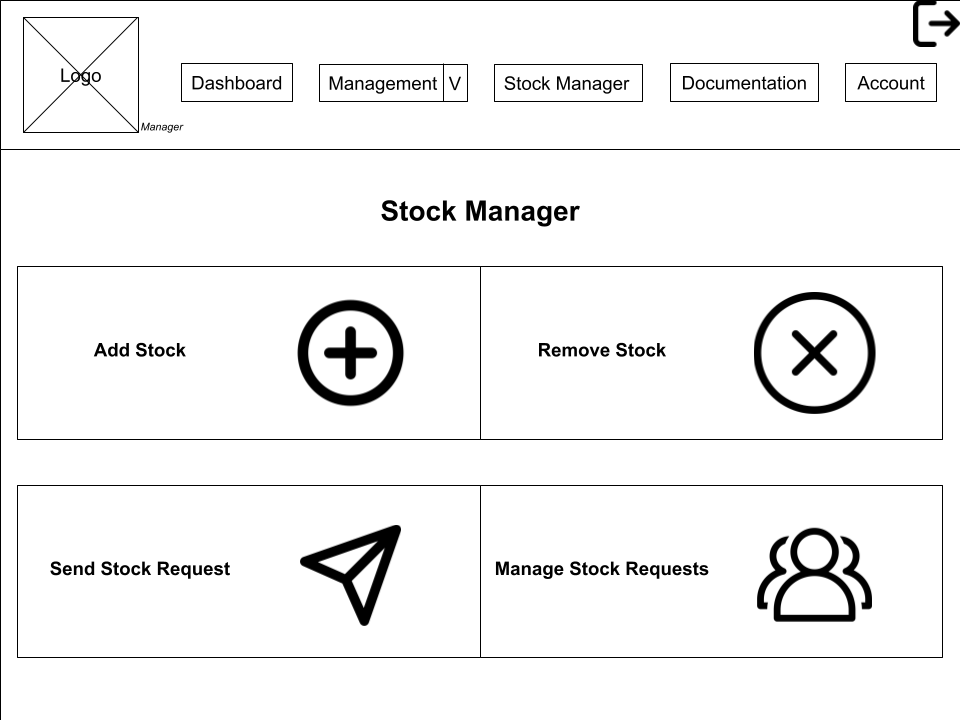

As a [Description of user], admin for a cleaning business
I want [functionality], a system that allows me to manage, stock and recieve requests for supplies and resources 
so that [benefit], employees can have access to supplies they need and request more

# User story title: Storage System

## Priority: 10
Could have:
The addition of a storage system is mandatory. Managing supplies, jobs, locations, and cleaning methods is critical for workers in the cleaning business to perform their tasks effectively.

## Estimation: e.g. 2 days
Any notes on estimation:
* Aaron: x
* Seth: x 
* Harrison: 3 days

## Assumptions (if any):
- The inventory database will be accessible to all authorized admin users.
- Basic security measures are in place.
- No major integration conflicts exist with current systems.

## Description:
A centralized inventory system to store and manage supplies and resources. It should record critical data such as quantity, job associations, storage locations, and cleaning methods. This system is the backbone for tracking and managing the stock that employees rely on.

Description-v1:
A large database that accepts and organizes input from multiple users, categorizing information about supplies, job types, and cleaning locations. This will ensure that stock levels are accurately tracked and that resource details are maintained in a structured format.

## Tasks, see chapter 4:
- Design the database schema tailored for inventory management.
- Develop API endpoints to create, read, update, and delete (CRUD) inventory items.
- Implement UI components for data entry and viewing the inventory dashboard.
- Conduct testing to validate correct data handling and user interaction.

# UI Design:
- Develop a dashboard interface displaying current supplies with search and filter functionality.
- Include detailed views for inventory items with edit options.

# Completed:
(Not completed)
