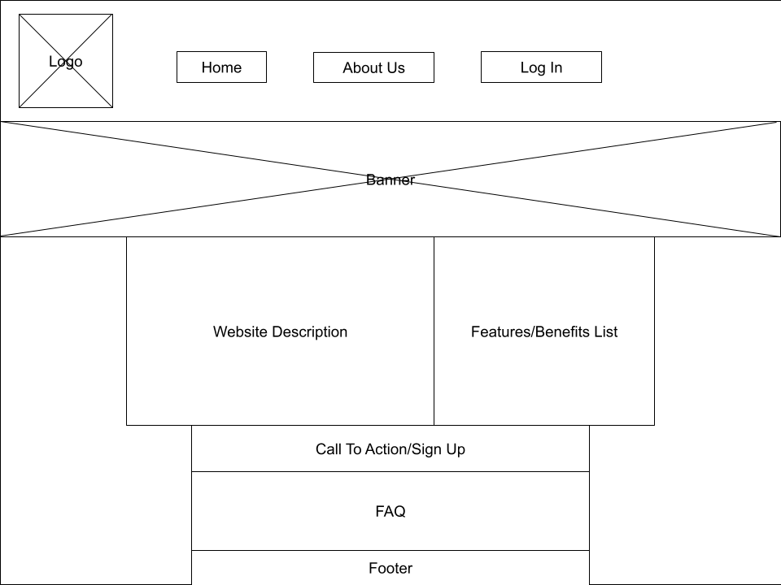

Create more md files like this one as needed. Place them into the same folder 
as this [user_stories folder](./)

# User story title: Landing Page

Keep any other version here as well, e.g. Display current deals, Let user to click on "show-current-deals".

## Priority: 10 (e.g. latest for iteration-1)
Essential to have a functional & accessible landing page, so that users have the opportunity to navigate to the correct page in an accessible & intuitive way

## Estimation: e.g. 2 days
Any notes on estimation go here. Keep your planning poker game numbers. For example
* Aaron: x
* Seth: 1 day
* Harrison: 0.5 days

## Assumptions (if any):

## Description: e.g. The web page will show current deals to Orion's orbits users

Description-v1: e.g. Landing page where users will be directed upon entering the webpage

## Tasks, see chapter 4.

## UI Design:

# Completed:

