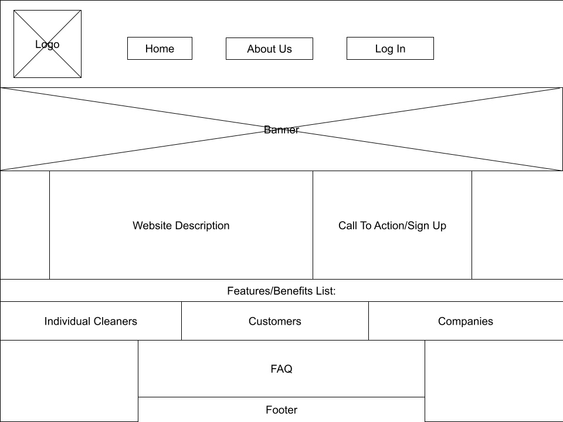

# User story title: Landing Page

## Priority: 10 (Latest for Iteration-2)
Must-Have
Justification:Essential to have a functional & accessible landing page, so that users of all types have the opportunity 
to navigate to the correct page in an accessible & intuitive way.

## Estimation:
* Aaron: 2 days
* Seth: 1 day
* Harrison: 0.5 days

## Assumptions (if any):

## Description:

Description-v1: e.g. Landing page where users will be directed upon entering the webpage

Description-v2: As a future user, I want a landing page which gives me a simple overview of the product, and relevant
directions on where to sign up so that I can begin accessing the services I require either as a customer, individual 
cleaner or company.

## Tasks:
- Create index/landing page - Estimation: 1 day
- Create about us page - Estimation: 0.5 days

## UI Design:

# Completed:

