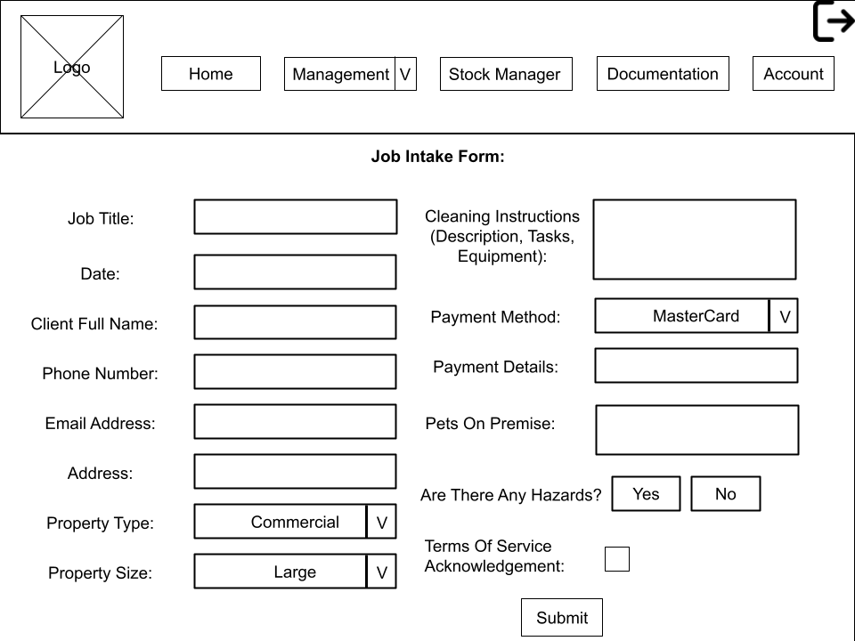

As a [Description of user], admin for scrubit clean
I want [functionality], a more user-friendly and consistent information sheet
so that [benefit], so that collecting, storing and storing information is easier

prioities from the user story

10: form to fill out about the job requirements
10: storing job requirements input information
20: easy to access job requirements infomation
20: client self booking for cleaning jobs

# User story title: Job Intake Form

## Priority: 10
Could have:
A fully detailed job intake sheet that has all necessary information points.

## Estimation: e.g. 2 days
Any notes on estimation:
* Aaron: 3 days
* Seth: 2 days 
* Harrison: 3 days

## Assumptions (if any):
- Admin users will have access to create and edit the form.
- The form will cover all necessary job-related details (e.g., job type, location, required supplies).

## Description:
A user-friendly, comprehensive form that allows admins to fill out job requirements in a consistent manner. This will ensure that all necessary details are collected at the time of job intake, facilitating smooth operations.

Description-v1:
A detailed intake sheet that prompts users to enter all relevant information related to the job and tasks, ensuring completeness and consistency.

## Tasks, see chapter 4:
- Design the form layout and define required fields.
- Develop frontend UI components for the form.
- Implement form validation to ensure required fields are completed.
- Test the form for usability and functionality.

# UI Design:
- A clean, intuitive interface with labeled input fields for job requirements.

# Completed:
(Not completed)
